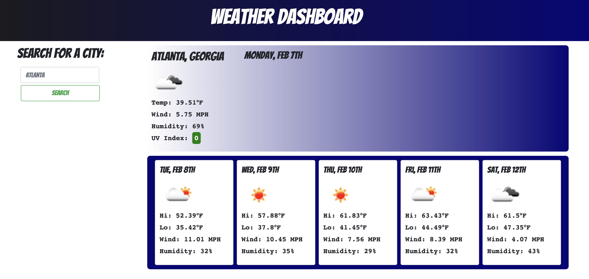

# Weather Dashboard

## Mitchel Wachtel - mitchel.wachtel@gmail.com

---
## Description

Technologies used: Javascript with HTML, CSS, jQuery, Bootstrap, the OpenWeather API, and Moment.js. GitHub pages was used in order to publish the site.

This weather dashboard was created to provide the user with weather from cities they travel at a convenience. This app displays the most important infomation in an easy to read format and saves a user's searches for their next trip to the site using local storage.

My main motivation to create this weather app was to understand how to work with APIs.  The other topic I was excited to practice was working with the DOM - Appending elements and adding classes with jQuery. 

I feel very comfortable using the openweather API platform now and it has given me confidence in using other APIs as well. APIs are such a tool that really open up my options as a developer. 

The biggest struggles in this project were finding the latitude and longitude for a city as it is searched. I had to research the openweather api documents, but I learned how to use the documentation for APIs through this struggle. Additionally, I had to figure out how to set up the elements and append them to the DOM. Once I understood the pattern, I was able to do this efficiently, even with a for loop to create the 5-day forcast.

The next step would definitely be to add a button that would clear the local Storage and search history. This would be convenience for the user so that their interface does not become clogged with a surplus of buttons from previous searches.

---

### **Deployed Site** can be found *[here](https://www.mitchelwachtel.me/weather-dashboard/)*. 

---

### **GitHub Repository** can be found *[here](https://github.com/mitchelwachtel/weather-dashboard)*.

---
## Installation 

Simply open in a brower and the webpage should appear as below.

---
## Credits

The most helpful resource was the OpenWeather API Documentation *[here](https://openweathermap.org/api/one-call-api)*. I would not have been able to make these API calls without this source that explained how to set up the urls. 

---
## Licensed

GNU General Public License v3.0
